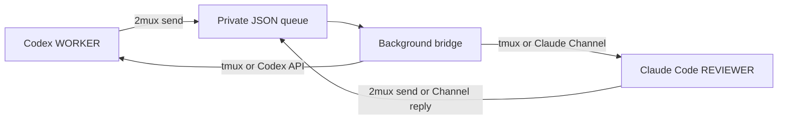
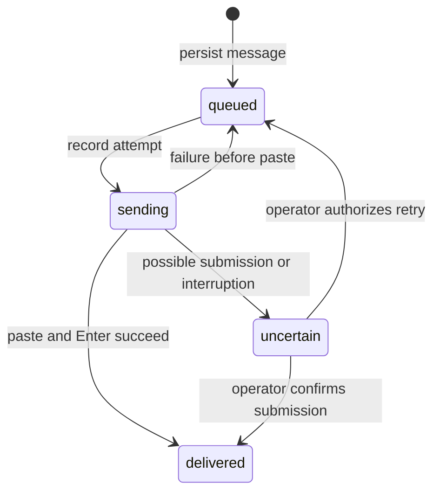
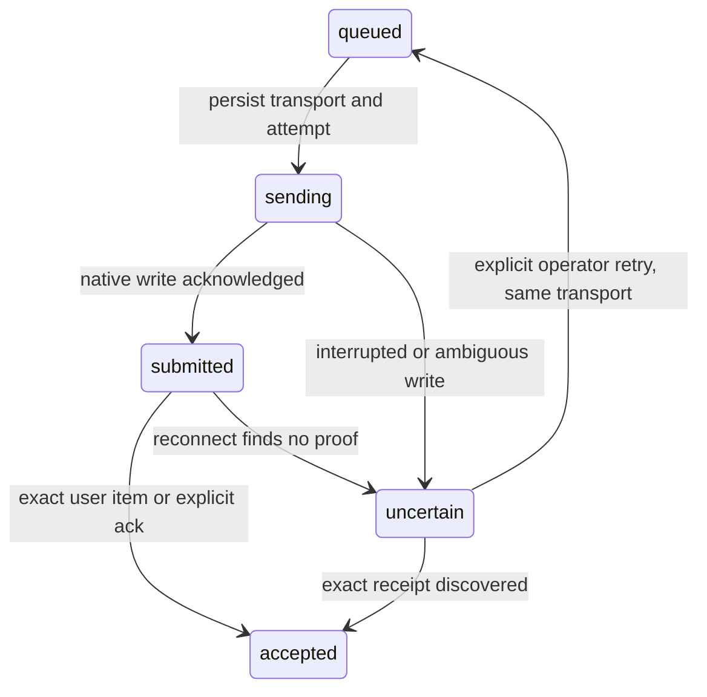

# Architecture and development

[Українська версія](architecture.uk.md) · [Documentation](README.md) · [CLI reference](cli.md)

## Components

2mux is a Go executable using tmux and `ps`; its optional Codex API transport adds the `github.com/coder/websocket` dependency. It launches installed agent CLIs, persists messages locally and submits them through the transport selected for each role. Models and account configuration remain with the agent CLIs.



Both panes share one project working tree and Unix account. The generated reviewer instructions request inspection without editing, and the reviewer launch denies Claude Code's `Edit`, `Write` and `NotebookEdit` tools; shell commands remain subject to Claude Code's permissions, so this does not enforce read-only access. Message sender labels likewise do not authenticate the caller.

| Source | Responsibility |
| --- | --- |
| [main.go](../main.go) | Command parsing, canonical directory/session selection, role prompts, agent launch and operator output. |
| [tmux.go](../tmux.go) | tmux subprocesses, session creation/ownership, pane registration, attach/stop and private-directory validation. |
| [queue.go](../queue.go) | Message validation, IDs, atomic JSON records, ordering, state transitions and explicit resolution. |
| [bridge.go](../bridge.go) | Background process, locks, health and the delivery loop. |
| [pane.go](../pane.go) | Pane readiness: foreground-agent detection, quiet-screen and dialog checks, paste and submit. |
| [conversation.go](../conversation.go) | Typed request/verdict correlation, exact reply IDs, duplicate-verdict checks and Git scope validation across all transports. |
| [transport.go](../transport.go), [codexrpc.go](../codexrpc.go) | Private Codex backend lifecycle, thread identity, WebSocket RPC and native queue submission. |
| [channel.go](../channel.go) | Claude MCP Channel delivery, exact-ID `ack` and correlated `reply`. |
| [state.go](../state.go), [events.go](../events.go), [status.go](../status.go), [codexstate.go](../codexstate.go) | Session config, reduced role state, hook/native events, legacy Codex TUI observation, JSON status and watch output. |
| [reconcile.go](../reconcile.go) | Reconcile attempted native deliveries using exact receipt evidence without automatic replay. |
| [presentation.go](../presentation.go) | Incoming role cards, compact send/ack/reply receipts, conversation-display instructions and read-only tmux pane header jobs. |
| [version.go](../version.go) | Build version, defaulting to `dev`. |
| [testdata/agent/main.go](../testdata/agent/main.go) | Deterministic local TUI fixture for integration tests. |

Presentation preserves the full body and the existing exact-ID protocol boundaries; only tool receipt previews are shortened. Human role cards precede protocol metadata so collapsed native notification previews show the sender and direction first. The `_badge` format job reads validated queue records and outputs only fixed role/type/state labels, with a compact variant for narrow panes. Message text is never interpolated into tmux styles or shell commands. `start` and `respawn` apply the headers to registered role panes; unrelated panes retain their titles. The [tmux manual](https://man.openbsd.org/tmux.1#FORMATS) documents the asynchronous format jobs and [pane border formats](https://man.openbsd.org/tmux.1#pane-border-format).

## Session identity and lifecycle

The canonical directory comes from `os.Getwd` and `filepath.EvalSymlinks`. The session name combines a sanitized project basename with the first five bytes of its SHA-256 path hash. The name depends on the project path; commands also verify ownership rather than relying on the name alone.

Session options record:

| tmux option | Stored value |
| --- | --- |
| `@twomux_cwd` | Canonical project directory. |
| `@twomux_worker` | Registered worker pane ID. |
| `@twomux_reviewer` | Registered reviewer pane ID. |
| `@twomux_runtime` | This session's private temporary directory. |

Role lookup checks the stored ID against live panes across the whole session. Pane position and active window do not define role identity. A replacement pane does not inherit a role automatically; only `respawn` registers a new pane, explicitly, when the old one was removed.

`start` creates/reuses the session and ensures the bridge is running. For a new `--agents` session, it respawns each pane with the appropriate CLI and prompt; `remain-on-exit` preserves an exited pane for diagnosis and for `respawn`. Reattachment does not relaunch agents, and a dead role pane only produces a warning. The bridge verifies the directory and runtime markers during its loop. It exits when tmux confirms the session is gone or its markers changed, and tolerates other tmux errors, such as timeouts, for up to 30 seconds. `stop` signals the bridge and kills the owned session, retaining runtime records.

Before discovering or initializing a session, `start` and `stop` acquire a per-project `flock` in the fixed private `/tmp/2mux-control-UID` directory on Linux/macOS. This namespace is independent of caller `TMPDIR`, unlike the message runtime directory. They wait up to ten seconds for the lock. This covers first creation, when no runtime exists yet, and prevents stop from interrupting initialization. The lock is released before interactive attachment; its file remains for reuse and contains no message bodies.

## Runtime files

The runtime directory is created with `os.MkdirTemp`, with mode `0700`. The CLI prints the path in `status`; it is not part of the project tree. Validation requires an absolute directory owned by the current Unix user with exactly those permissions.

| File or directory | Purpose |
| --- | --- |
| `messages/ID.json` | Message body, receipt state and optional delivery error. `messages/` has mode `0700`; record files have mode `0600`. |
| `health.json` | Bridge PID, UTC update time and optional last error. |
| `bridge.log` | Bridge child-process stdout/stderr. |
| `start.lock` | Serialize bridge startup and readiness checks. |
| `bridge.lock` | Allow one bridge process to own this runtime. |
| `queue.lock` | Serialize delivery batches, archiving and operator resolution. |
| `messages/archive/` | Delivered records older than 24 hours, moved out of the scanned directory. |

Locks use nonblocking Unix `flock` and are released by the kernel when the file descriptor closes or the process dies. Enqueue and delivery share the queue lock so reference and duplicate-verdict validation is atomic; each message gets a random 128-bit ID. JSON writes use a same-directory temporary file, file sync, close and rename, so readers see complete records. This does not promise survival after loss or clearing of temporary storage.

A message record contains `id`, `from`, `to`, `text`, `created`, `status` and optional `error`. `created` uses UTC. Reading validates IDs, filenames, senders (`user`, `worker`, `reviewer`), recipients, nonzero creation times, text and known states, then sorts by creation time and ID as a tie-breaker. A corrupt record stops delivery rather than being silently skipped; `status` and `messages` still show the valid records and name the corrupt files. Sender validation protects the terminal header from injected control characters, and rejecting body lines that start with `[2mux` prevents a body from imitating a second header. Delivered text ends with `[2mux end of message ID]`; the random ID is unknown to the sender when it writes the body.

## Delivery state machine



Each batch attempts at most eight messages. An unavailable or uncertain recipient blocks later messages to that recipient while the other direction can continue. Completed records are skipped. On recovery, an interrupted `sending` record becomes `uncertain` because submission may already have happened. This prevents an automatic retry of an ambiguous outcome; it does not guarantee model-level exactly-once processing.

Before delivering, the bridge checks that the pane is alive, outside copy mode and accepting input. `ps` inspects only foreground processes on that terminal. Recognized forms include native Codex/Claude Code processes and supported Node/Bun Claude Code launch forms; a generic Node process or shell is insufficient. A native process is recognized by its executable name only, so any foreground program named `codex` or `claude` is accepted. The native Claude Code installer binary is also accepted: its process name is a version such as `2.1.289` and its argv0 is `claude`. The bridge then captures the visible screen. It waits while the screen changed within the last second, remembering a hash per pane across ticks, and while known confirmation phrases, including Codex approvals and Claude Code permission dialogs such as `Do you want to proceed?`, `Do you want to make this edit`, `Do you want to create` or `Esc to cancel`, appear in the bottom 15 non-blank lines. Both checks happen before a record is marked `sending`, so a pane that cannot receive does not cause record writes on every tick.

For Node/Bun, detection accepts a direct script entry point under `/@anthropic-ai/claude-code/` ending in `.js`, including a resolved `claude` symlink and `bun run SCRIPT`. A Claude Code path among another program's arguments or runtime options does not authorize delivery. Arbitrary runtime flag combinations are not recognized as script entry points.

Delivery loads a uniquely named tmux buffer, rechecks the pane, uses bracketed paste with LF preservation, waits 150 ms, rechecks readiness and sends Enter. Failure before paste leaves the record queued. Paste errors and later failures become uncertain. tmux does not report whether an application enabled bracketed paste; Codex and Claude Code enable it at their prompts. These checks reduce misdelivery but cannot infer the meaning or readiness of every native CLI dialog.

The bridge loop uses a 300 ms ticker and writes health after each batch and before each delivery attempt. Health older than 15 seconds is considered unresponsive. Most tmux calls have a five-second timeout; foreground inspection has three seconds. A failed health write is logged but does not stop the bridge. About once a minute the bridge archives old delivered records. These are implementation bounds, not an end-to-end delivery deadline.

## Development and validation

Run from the source checkout:

```sh
go build -o 2mux .
go test -race ./...
go vet ./...
```

Ordinary test runs skip the opt-in tmux and native-agent suites. Enable them explicitly:

```sh
TWOMUX_INTEGRATION=1 go test -race -v ./...
TWOMUX_NATIVE_SMOKE=1 go test -v -run TestInstalledAgentPresence
```

| Tests | Evidence provided |
| --- | --- |
| [main_test.go](../main_test.go), [bridge_test.go](../bridge_test.go) | Session names, invalid arguments, explicit sending without tmux environment, queue ordering, batch bounds, concurrency, ambiguous delivery, validation including forged headers, corrupt-record reporting, archiving, quiet-screen and dialog checks, private directories, locks and foreground-process detection. |
| [docs_test.go](../docs_test.go) | English and Ukrainian documents have matching headings, table rows, list items and code fences. |
| [integration_test.go](../integration_test.go) | An isolated tmux socket and TUI fixtures (binaries named `codex` and `claude`) exercise concurrent first starts across different `TMPDIR`s, stop waiting during initialization, concurrent agent starts, worker → review → correction → rereview → approval, UTF-8, detach, pane changes, recovery and delivery guards. Test project lock files are removed after all commands finish. No model/network calls. |
| [native_test.go](../native_test.go) | Installed Codex and Claude Code process identification on a separate tmux socket without submitting a model prompt. Requires installed CLIs; account/model configuration and model execution are not validated. |

Fixture tests establish transport behavior. Native smoke establishes process recognition. Neither verifies real model responses, the agent's prompt queue behavior or business correctness. The recorded [live review](../REVIEW.md) and [receipts](../validation/live-review-20260930.json) establish one historical real-agent scenario from an earlier Codex + pi pair and list its limits; they are not results of a new run. [CI](../.github/workflows/ci.yml) runs formatting, vet, unit and integration tests on Linux and macOS with Go 1.22 and the current stable release.

For a Linux compile check from another host:

```sh
GOOS=linux GOARCH=amd64 go build -o /tmp/2mux-linux-amd64 .
```

Cross-building does not test Linux runtime behavior. The module declares Go 1.22; testing with a newer compiler does not independently establish compatibility with that minimum toolchain.

When changing CLI behavior, update help in `main.go`, the root READMEs and both language versions of affected docs; `docs_test.go` fails if their structure diverges. Keep documented syntax, state semantics and recovery actions aligned with the implementation, and run the relevant transport tests when changing delivery or session handling.

## Native transports and structured receipts

`codexrpc.go` uses `github.com/coder/websocket` v1.8.12 (ISC, pure Go) for HTTP Upgrade over a private Unix socket. Unix transport is WebSocket, not JSONL. Replies are multiplexed by ID, foreign-thread events and model text deltas are ignored, and event-buffer overflow forces reconnection rather than silently losing state. Server approval/user-input requests are observed but never answered. The native TUI owns decisions. `transport.go` owns backend setup, thread identity and server-queue submission.

`channel.go` is an MCP JSON-lines stdio server advertising only `claude/channel` and tools, using protocol revision `2025-03-26`. Its `ack` confirms one exact receipt; `reply` enqueues a precisely correlated note or review verdict. It never advertises `claude/channel/permission`. Session-specific `mcp.json` and `claude-settings.json` stay in the private runtime directory; no global settings or project MCP config is rewritten. Channel process health proves MCP connectivity only.

`state.go`, `events.go` and `status.go` store reduced role state, never hook prompt/tool payloads or transcript paths. States are `unknown`, `starting`, `idle`, `busy`, `awaiting_approval`, `awaiting_input`, `exited`. SessionStart starts in `starting`; Stop/idle notifications establish idle. Missing observers make reported state unknown. A turn's completion is state evidence, never a business verdict.

Without `--codex-api`, `codexstate.go` observes the registered WORKER pane once per second. It verifies a foreground Codex process and recognizes explicit TUI working controls, an idle prompt/footer, and supported approval dialogs; JSON reports `source: "codex-tui"`. This is a display heuristic, not native event evidence. Unrecognized screens, copy mode, disabled input, probe errors and a stopped/stale bridge report `unknown`; a missing/dead pane reports `exited` while the bridge is healthy. Captured text is never stored, and this observer does not change delivery readiness or answer dialogs.

Native message records add `transport`, `attempt`, `kind`, `reply_to`, `verdict`, `scope`, `steer`, `turn_ref`, `submitted_at`. The chosen transport is persisted before the attempt. Successful native submission becomes `submitted`; exact user-item/explicit ack evidence becomes `accepted`. Legacy `delivered` records remain readable. `reconcile.go` inspects Codex queue/item pages after reconnect and marks missing receipts uncertain; Channel restart marks unacknowledged submissions uncertain. No automatic transport switch or replay is allowed after any attempt. An explicit operator retry retains the chosen transport. Typed review records remain active so exact references and duplicate-verdict checks remain possible.



The app-server backend has its own pane in the session's `2mux-api` window and a Unix socket in the runtime directory (`0700`, observed socket `0600`). Its pane/thread IDs and the Claude session UUID are persisted in `session.json`. Starting a second backend while its registered pane is alive is rejected. Agent respawn resumes the saved session. Runtime cleanup is controlled by the existing tmux session lifecycle; no shared daemon is terminated.

Additional tests cover out-of-order RPC replies, connection loss, approval non-response, thread filtering, exact receipt IDs, Channel handshake/ack/reply, crash reconciliation, fixed transports, stale Git scopes, foreign hooks and hook payload privacy. Run `TWOMUX_PROTOCOL_SMOKE=1 go test -v -run TestNativeCodexProtocol` for a real isolated Codex socket/thread/queue probe, without requesting inference. The [evidence record](../validation/native-communication-20261005.json) distinguishes this probe from unverified real-TUI/policy gates. Native CLI versions are conservatively pinned until revalidated. Codex 0.160.0 schema and isolated WebSocket/queue/restart checks are recorded in the [new protocol evidence](../validation/codex-0160-native-20261005.json); these checks do not prove native TUI inference or multi-client approval routing. Explicit native requests fail on unsupported versions before a new session is created and never downgrade to tmux. Status snapshots include the configured transport of each role.

Protocol sources: [Codex app-server](https://learn.chatgpt.com/docs/app-server), [Claude Channels](https://code.claude.com/docs/en/channels-reference), [Claude hooks](https://code.claude.com/docs/en/hooks).
