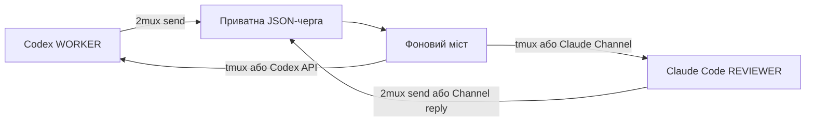
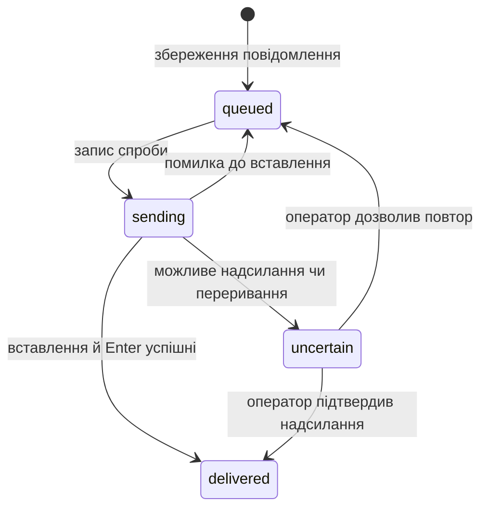
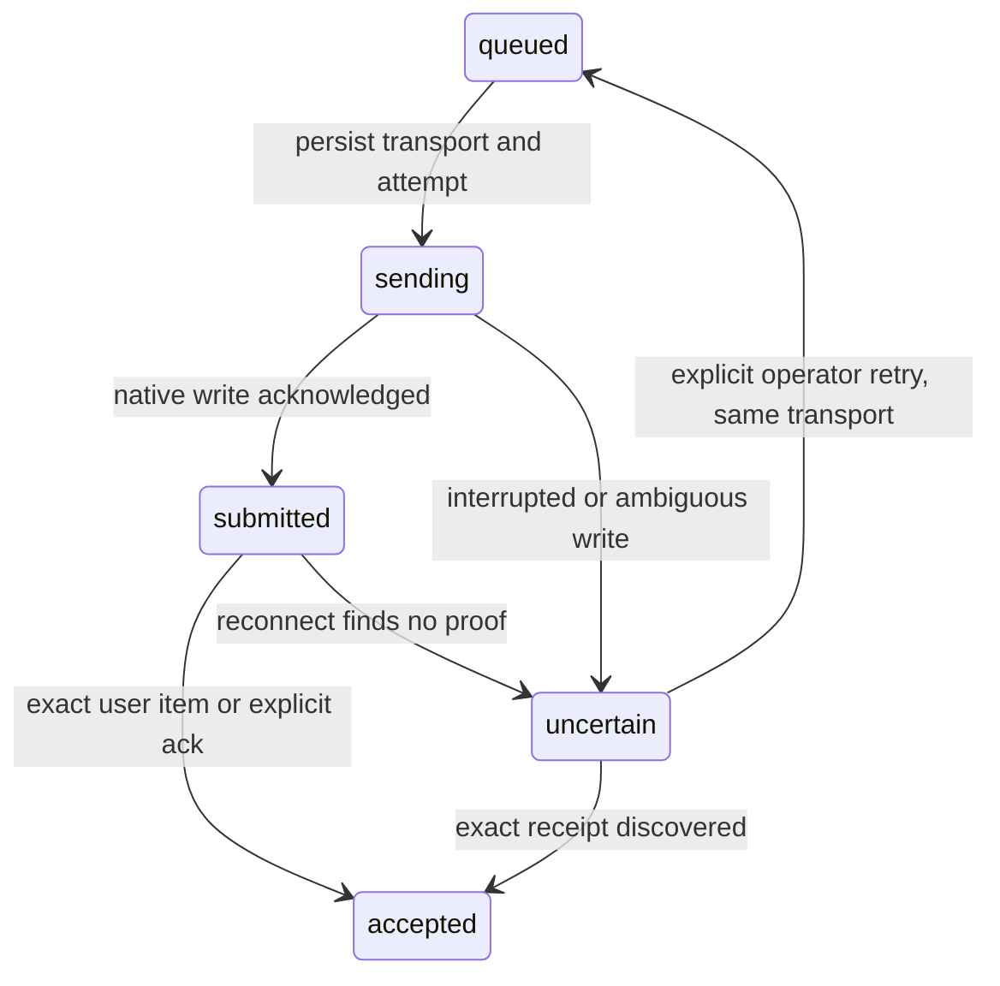

# Архітектура та розробка

[English version](architecture.md) · [Документація](README.uk.md) · [Довідник CLI](cli.uk.md)

## Компоненти

2mux — виконувана Go-програма з tmux і `ps`; додатковий транспорт Codex API використовує залежність `github.com/coder/websocket`. Вона запускає встановлені CLI агентів, зберігає повідомлення локально й надсилає їх через транспорт, обраний для кожної ролі. Моделі й налаштування облікових записів залишаються у CLI агентів.



Обидві панелі мають спільне робоче дерево проєкту та обліковий запис Unix. Згенеровані інструкції рев’юера вимагають перевірки без редагування, а запуск рев’юера забороняє інструменти Claude Code `Edit`, `Write` і `NotebookEdit`; команди оболонки й далі підлягають дозволам Claude Code, тож доступ лише для читання не забезпечується. Позначки відправника повідомлень також не автентифікують того, хто викликав команду.

| Файл | Відповідальність |
| --- | --- |
| [main.go](../main.go) | Розбір команд, визначення канонічного каталогу/сесії, інструкції ролей, запуск агентів і вивід оператору. |
| [tmux.go](../tmux.go) | Підпроцеси tmux, створення/належність сесій, реєстрація панелей, підключення/зупинення та перевірка приватних каталогів. |
| [queue.go](../queue.go) | Перевірка повідомлень, ID, атомарні JSON-записи, порядок, переходи станів і явне визначення результату доставки. |
| [bridge.go](../bridge.go) | Фоновий процес, блокування, стан роботи та цикл доставки. |
| [pane.go](../pane.go) | Готовність панелі: розпізнавання активного агента, перевірки спокійного екрана й діалогів, вставлення та надсилання. |
| [conversation.go](../conversation.go) | Кореляція typed-запитів/вердиктів, точні ID відповідей, захист від повторних вердиктів і перевірка Git scope для всіх транспортів. |
| [transport.go](../transport.go), [codexrpc.go](../codexrpc.go) | Життєвий цикл приватного backend Codex, ідентичність thread, WebSocket RPC та надсилання в native-чергу. |
| [channel.go](../channel.go) | Доставка Claude MCP Channel, `ack` точного ID та пов’язаний `reply`. |
| [state.go](../state.go), [events.go](../events.go), [status.go](../status.go), [codexstate.go](../codexstate.go) | Налаштування сесії, скорочені стани ролей, hook/native-події, спостереження legacy Codex TUI, JSON-статус і watch. |
| [reconcile.go](../reconcile.go) | Узгодження native-спроб за доказами точних квитанцій без автоматичного повтору. |
| [presentation.go](../presentation.go) | Вхідні картки ролей, компактні квитанції send/ack/reply, інструкції видимого обміну та read-only завдання заголовків панелей tmux. |
| [version.go](../version.go) | Версія збирання, типово `dev`. |
| [testdata/agent/main.go](../testdata/agent/main.go) | Детермінована локальна TUI-фікстура для інтеграційних тестів. |

Оформлення зберігає повний текст і наявні протокольні межі з точним ID; скорочуються лише прев’ю квитанцій інструментів. Картки ролей передують протокольним метаданим, тому згорнуте native-повідомлення спочатку показує відправника й напрямок. Завдання формату `_badge` читає перевірені записи черги й виводить лише сталі позначки ролей, типів і станів, зі скороченим варіантом для вузьких панелей. Текст повідомлень не підставляється у стилі tmux або shell-команди. `start` та `respawn` застосовують заголовки до зареєстрованих панелей ролей; сторонні панелі зберігають власні назви. [Мануал tmux](https://man.openbsd.org/tmux.1#FORMATS) описує асинхронні завдання форматів і [формати меж панелей](https://man.openbsd.org/tmux.1#pane-border-format).

## Ідентичність і життєвий цикл сесії

Канонічний каталог визначається через `os.Getwd` і `filepath.EvalSymlinks`. Назва сесії поєднує очищену назву каталогу проєкту та перші п’ять байтів SHA-256 хешу його шляху. Назва залежить від шляху проєкту; команди також перевіряють належність, а не покладаються лише на назву.

Параметри сесії зберігають:

| Параметр tmux | Значення |
| --- | --- |
| `@twomux_cwd` | Канонічний каталог проєкту. |
| `@twomux_worker` | Зареєстрований ID панелі виконавця. |
| `@twomux_reviewer` | Зареєстрований ID панелі рев’юера. |
| `@twomux_runtime` | Приватний тимчасовий каталог цієї сесії. |

Пошук ролі звіряє збережений ID із живими панелями всієї сесії. Положення панелі та активне вікно не визначають роль. Нова панель не успадковує роль автоматично; лише `respawn` явно реєструє нову панель, коли стару видалено.

`start` створює/використовує сесію та забезпечує роботу мосту. Для нової сесії з `--agents` він перезапускає кожну панель із потрібним CLI та інструкцією; `remain-on-exit` зберігає завершену панель для діагностики та для `respawn`. Повторне підключення не перезапускає агентів, а завершена панель ролі лише спричиняє попередження. Міст перевіряє позначки каталогу й runtime під час свого циклу. Він завершується, коли tmux підтверджує, що сесії немає або її позначки змінилися, а інші помилки tmux, як-от таймаути, терпить до 30 секунд. `stop` надсилає сигнал мосту й завершує власну сесію, залишаючи runtime-записи.

Перед пошуком чи ініціалізацією сесії `start` і `stop` отримують окреме для проєкту блокування `flock` у сталому приватному каталозі `/tmp/2mux-control-UID` на Linux/macOS. Цей простір не залежить від `TMPDIR` того, хто викликав команду, на відміну від runtime-каталогу повідомлень. Вони очікують блокування до десяти секунд. Воно охоплює перше створення, коли runtime ще немає, та запобігає перериванню ініціалізації командою stop. Блокування звільняється перед інтерактивним підключенням; його файл залишається для повторного використання та не містить текстів повідомлень.

## Runtime-файли

Runtime-каталог створюється через `os.MkdirTemp` із правами `0700`. CLI показує шлях через `status`; він не є частиною дерева проєкту. Перевірка вимагає абсолютного каталогу поточного користувача Unix саме з такими правами.

| Файл або каталог | Призначення |
| --- | --- |
| `messages/ID.json` | Текст повідомлення, стан квитанції та можлива помилка доставки. `messages/` має права `0700`, файли записів — `0600`. |
| `health.json` | PID мосту, час оновлення UTC та можлива остання помилка. |
| `bridge.log` | stdout/stderr дочірнього процесу мосту. |
| `start.lock` | Серіалізація запуску мосту й перевірки готовності. |
| `bridge.lock` | Дозволити одному процесу мосту володіти цим runtime. |
| `queue.lock` | Серіалізація порцій доставки, архівування та визначення результату оператором. |
| `messages/archive/` | Доставлені записи, старші за 24 години, перенесені з каталогу, що сканується. |

Блокування використовують неблокувальний Unix `flock` і звільняються ядром після закриття файлового дескриптора або завершення процесу. Enqueue та delivery використовують queue lock для атомарної перевірки посилань і повторних вердиктів; кожен запис отримує випадковий 128-бітний ID. Запис JSON використовує тимчасовий файл у тому самому каталозі, синхронізацію файла, закриття та перейменування, тому читачі бачать цілі записи. Це не обіцяє збереження після втрати чи очищення тимчасового сховища.

Запис повідомлення містить `id`, `from`, `to`, `text`, `created`, `status` і необов’язкове `error`. `created` використовує UTC. Читання перевіряє ID, назви файлів, відправників (`user`, `worker`, `reviewer`), адресатів, ненульовий час створення, текст і відомі стани, потім сортує за часом створення та ID за однакового часу. Пошкоджений запис зупиняє доставку, а не мовчки пропускається; `status` і `messages` усе одно показують коректні записи й називають пошкоджені файли. Перевірка відправника захищає заголовок у терміналі від вставлених керівних символів, а відхилення рядків тексту, що починаються з `[2mux`, не дає тексту імітувати другий заголовок. Доставлений текст закінчується `[2mux end of message ID]`; відправник не знає випадкового ID, коли пише текст.

## Стани доставки



Кожна порція обробки робить не більше восьми спроб. Недоступний адресат чи невизначена доставка блокують наступні повідомлення цьому адресату, а інший напрямок може працювати далі. Завершені записи пропускаються. Під час відновлення перерваний запис `sending` стає `uncertain`, бо надсилання вже могло відбутися. Це запобігає автоматичному повтору неоднозначного результату; воно не гарантує обробку рівно один раз на рівні моделі.

Перед доставкою міст перевіряє, чи панель жива, поза режимом копіювання та приймає ввід. `ps` перевіряє лише активні процеси цього термінала. Розпізнаються нативні процеси Codex/Claude Code й підтримувані форми запуску Claude Code через Node/Bun; звичайного Node-процесу чи оболонки недостатньо. Нативний процес розпізнається лише за назвою виконуваного файла, тож приймається будь-яка активна програма з назвою `codex` або `claude`. Також приймається нативний бінарний файл інсталятора Claude Code: назва його процесу — версія на кшталт `2.1.289`, а argv0 — `claude`. Потім міст знімає видимий екран. Він чекає, якщо екран змінювався протягом останньої секунди (хеш для кожної панелі зберігається між тактами), і поки відомі фрази підтвердження, зокрема схвалення Codex і діалоги дозволів Claude Code на кшталт `Do you want to proceed?`, `Do you want to make this edit`, `Do you want to create` чи `Esc to cancel`, видно в нижніх 15 непорожніх рядках. Обидві перевірки виконуються до позначення запису як `sending`, тож панель, що не може прийняти текст, не спричиняє запис файлів на кожному такті.

Для Node/Bun розпізнавання приймає прямий шлях до скрипта в `/@anthropic-ai/claude-code/`, що закінчується на `.js`, зокрема розв’язаний символьний лінк `claude` та `bun run SCRIPT`. Шлях Claude Code серед аргументів іншої програми чи параметрів середовища виконання не дозволяє доставку. Довільні комбінації параметрів середовища виконання не розпізнаються як шлях до скрипта.

Доставка завантажує буфер tmux з унікальною назвою, повторно перевіряє панель, використовує bracketed paste зі збереженням LF, очікує 150 мс, повторно перевіряє готовність і надсилає Enter. Помилка до вставлення залишає запис у черзі. Помилки вставлення та пізніші збої стають невизначеними. tmux не повідомляє, чи ввімкнув застосунок bracketed paste; Codex і Claude Code вмикають його у своїх полях запиту. Ці перевірки зменшують ризик помилкової доставки, але не визначають зміст чи готовність кожного власного діалогу CLI.

Цикл мосту використовує таймер із періодом 300 мс і записує стан після кожної порції та перед кожною спробою доставки. Оновлення стану давніше 15 секунд вважається ознакою відсутності відповіді. Більшість викликів tmux мають таймаут п’ять секунд, перевірка активних процесів — три. Невдалий запис стану журналюється, але не зупиняє міст. Приблизно раз на хвилину міст архівує старі доставлені записи. Це межі реалізації, а не загальний гарантований час доставки.

## Розробка та перевірки

Виконуйте з каталогу вихідного коду:

```sh
go build -o 2mux .
go test -race ./...
go vet ./...
```

Звичайний запуск тестів пропускає додаткові набори tmux і нативних агентів. Увімкніть їх явно:

```sh
TWOMUX_INTEGRATION=1 go test -race -v ./...
TWOMUX_NATIVE_SMOKE=1 go test -v -run TestInstalledAgentPresence
```

| Тести | Що підтверджують |
| --- | --- |
| [main_test.go](../main_test.go), [bridge_test.go](../bridge_test.go) | Назви сесій, некоректні аргументи, явне надсилання без оточення tmux, порядок черги, межі порцій, конкурентність, неоднозначну доставку, перевірку даних зокрема підроблених заголовків, звіт про пошкоджені записи, архівування, перевірки спокійного екрана й діалогів, приватні каталоги, блокування й розпізнавання активних процесів. |
| [docs_test.go](../docs_test.go) | Англійська й українська версії документів мають однакові заголовки, рядки таблиць, пункти списків і блоки коду. |
| [integration_test.go](../integration_test.go) | Окремий сокет tmux і TUI-фікстури (бінарні файли з назвами `codex` і `claude`) перевіряють одночасні перші запуски з різними `TMPDIR`, очікування stop під час ініціалізації, одночасні запуски агентів, виконавець → рев’ю → виправлення → повторне рев’ю → схвалення, UTF-8, від’єднання, зміни панелей, відновлення та захист доставки. Файли блокувань тестового проєкту видаляються після завершення всіх команд. Без викликів моделей/мережі. |
| [native_test.go](../native_test.go) | Розпізнавання встановлених Codex і Claude Code на окремому сокеті tmux без надсилання запиту моделі. Потрібні встановлені CLI; налаштування облікових записів і моделей та виконання запитів моделями не перевіряються. |

Тести з фікстурами підтверджують поведінку транспорту. Native smoke підтверджує розпізнавання процесів. Жоден із них не перевіряє відповіді справжніх моделей, поведінку черги запитів агента чи бізнес-правильність. Зафіксоване [живе рев’ю](../REVIEW.uk.md) та [квитанції](../validation/live-review-20260930.json) підтверджують один історичний сценарій зі справжніми агентами попередньої пари Codex + pi й перелічують його межі; це не результати нового запуску. [CI](../.github/workflows/ci.yml) запускає перевірку форматування, vet, модульні й інтеграційні тести на Linux і macOS з Go 1.22 та поточним стабільним випуском.

Для перевірки компіляції під Linux з іншої системи:

```sh
GOOS=linux GOARCH=amd64 go build -o /tmp/2mux-linux-amd64 .
```

Кроскомпіляція не перевіряє роботу під Linux. Модуль декларує Go 1.22; тестування новішим компілятором окремо не підтверджує сумісність із цим мінімальним toolchain.

Змінюючи поведінку CLI, оновлюйте довідку в `main.go`, кореневі README та обидві мовні версії відповідної документації; `docs_test.go` не пройде, якщо їхня структура розійдеться. Узгоджуйте опис синтаксису, значення станів і дії відновлення з реалізацією та запускайте доречні транспортні тести після змін доставки чи керування сесіями.

## Native-транспорти та структуровані підтвердження

`codexrpc.go` використовує `github.com/coder/websocket` v1.8.12 (ISC, pure Go) для HTTP Upgrade через приватний Unix-сокет. Unix-транспорт — WebSocket, не JSONL. Відповіді зіставляються за ID, події чужих thread і текстові delta моделі ігноруються; переповнення буфера подій спричиняє перепідключення замість тихої втрати стану. Server requests для approval/введення спостерігаються, але не отримують відповіді. Рішення належать native TUI. `transport.go` керує backend, ідентичністю thread та поданням у серверну чергу.

`channel.go` — MCP-сервер через JSON-lines stdio, який оголошує лише `claude/channel` та tools із ревізією протоколу `2025-03-26`. `ack` підтверджує одне точне повідомлення; `reply` додає точно пов’язану нотатку або review-вердикт. `claude/channel/permission` ніколи не оголошується. Session-specific `mcp.json` і `claude-settings.json` лишаються у приватному runtime-каталозі; глобальні settings та MCP-конфігурація проєкту не переписуються. Health Channel-процесу доводить тільки MCP-підключення.

`state.go`, `events.go`, `status.go` зберігають скорочені стани ролей без prompt/tool payload або transcript path із hooks. Стани: `unknown`, `starting`, `idle`, `busy`, `awaiting_approval`, `awaiting_input`, `exited`. SessionStart задає `starting`; Stop/idle notifications підтверджують idle. Відсутність спостерігача робить показаний стан unknown. Завершення turn — доказ стану, а не бізнес-вердикт.

Без `--codex-api` файл `codexstate.go` раз на секунду спостерігає зареєстровану панель WORKER. Він перевіряє foreground-процес Codex і розпізнає явний індикатор роботи TUI, запрошення до вводу з footer та підтримувані approval-діалоги; JSON показує `source: "codex-tui"`. Це евристика відображення, а не доказ native-події. Нерозпізнані екрани, copy mode, вимкнений ввід, помилки перевірки та зупинений/застарілий bridge дають `unknown`; відсутня/мертва панель дає `exited`, поки bridge справний. Захоплений текст не зберігається; спостерігач не змінює готовність до доставки й не відповідає на діалоги.

Native-записи повідомлень додають `transport`, `attempt`, `kind`, `reply_to`, `verdict`, `scope`, `steer`, `turn_ref`, `submitted_at`. Обраний транспорт зберігається до спроби. Успішне native-подання стає `submitted`; точний user item/явний ack — `accepted`. Старі `delivered` записи лишаються читабельними. `reconcile.go` переглядає сторінки черги/items Codex після перепідключення й позначає відсутні підтвердження uncertain; перезапуск Channel позначає uncertain непідтверджені подання. Після будь-якої спроби немає автоматичного перемикання транспорту або повтору. Явний retry оператора лишає обраний транспорт. Типізовані review-записи лишаються активними для точних посилань і перевірок повторних вердиктів.



Backend app-server має власну панель у вікні сесії `2mux-api` та Unix-сокет у runtime-каталозі (`0700`, спостережений socket `0600`). ID панелі/thread та UUID сесії Claude зберігаються в `session.json`. Запуск другого backend при живій зареєстрованій панелі відхиляється. Respawn агента відновлює збережену сесію. Очищення runtime підпорядковується наявному життєвому циклу tmux-сесії; спільний daemon не зупиняється.

Додаткові тести перевіряють RPC-відповіді не по порядку, втрату з’єднання, відсутність відповіді на approval, фільтрацію thread, точні ID підтверджень, Channel handshake/ack/reply, crash reconciliation, фіксовані транспорти, застарілі Git scopes, чужі hooks і приватність hook payload. `TWOMUX_PROTOCOL_SMOKE=1 go test -v -run TestNativeCodexProtocol` запускає справжню ізольовану перевірку сокета/thread/черги Codex без запиту inference. [Запис доказів](../validation/native-communication-20261005.json) відокремлює її від неперевірених real-TUI/policy gates. Версії native CLI консервативно зафіксовані до повторної перевірки. Schema та ізольовані WebSocket/queue/restart перевірки Codex 0.160.0 зафіксовані в [нових доказах протоколу](../validation/codex-0160-native-20261005.json); вони не доводять inference у native TUI або маршрутизацію approvals між клієнтами. Явний native-запит відхиляється для непідтримуваної версії до створення нової сесії й не переходить на tmux. Знімки статусу містять налаштований транспорт кожної ролі.

Джерела протоколів: [Codex app-server](https://learn.chatgpt.com/docs/app-server), [Claude Channels](https://code.claude.com/docs/en/channels-reference), [Claude hooks](https://code.claude.com/docs/en/hooks).
