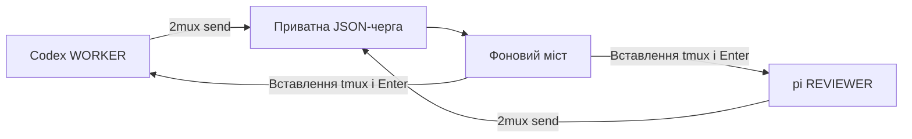
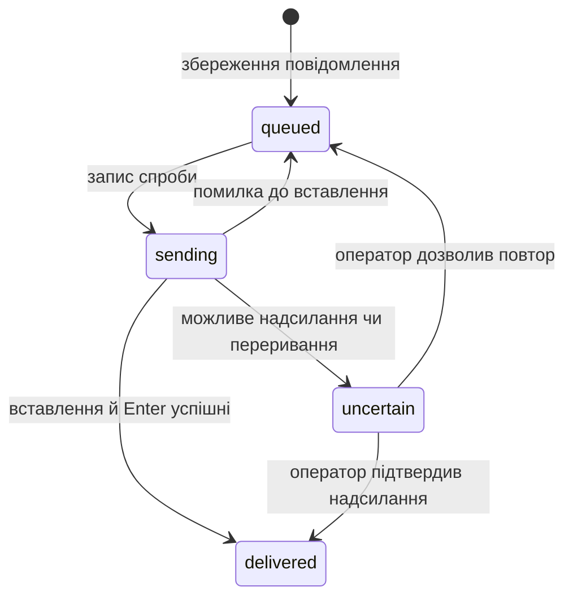

# Архітектура та розробка

[English version](architecture.md) · [Документація](README.uk.md) · [Довідник CLI](cli.uk.md)

## Компоненти

2mux — виконувана Go-програма зі стандартною бібліотекою, tmux і `ps`. Вона запускає встановлені CLI агентів, зберігає повідомлення локально та надсилає їх у термінали агентів. Моделі й налаштування облікових записів залишаються у CLI агентів.



Обидві панелі мають спільне робоче дерево проєкту та обліковий запис Unix. Згенеровані інструкції рев’юера вимагають перевірки без редагування; вони не забезпечують доступ лише для читання. Позначки відправника повідомлень також не автентифікують того, хто викликав команду.

| Файл | Відповідальність |
| --- | --- |
| [main.go](../main.go) | Розбір команд, визначення канонічного каталогу/сесії, інструкції ролей, запуск агентів і вивід оператору. |
| [tmux.go](../tmux.go) | Підпроцеси tmux, створення/належність сесій, реєстрація панелей, підключення/зупинення та перевірка приватних каталогів. |
| [queue.go](../queue.go) | Перевірка повідомлень, ID, атомарні JSON-записи, порядок, переходи станів і явне визначення результату доставки. |
| [bridge.go](../bridge.go) | Фоновий процес, блокування, стан роботи, розпізнавання активного агента та доставка в термінал. |
| [version.go](../version.go) | Версія збирання, типово `dev`. |
| [testdata/agent/main.go](../testdata/agent/main.go) | Детермінована локальна TUI-фікстура для інтеграційних тестів. |

## Ідентичність і життєвий цикл сесії

Канонічний каталог визначається через `os.Getwd` і `filepath.EvalSymlinks`. Назва сесії поєднує очищену назву каталогу проєкту та перші п’ять байтів SHA-256 хешу його шляху. Назва залежить від шляху проєкту; команди також перевіряють належність, а не покладаються лише на назву.

Параметри сесії зберігають:

| Параметр tmux | Значення |
| --- | --- |
| `@twomux_cwd` | Канонічний каталог проєкту. |
| `@twomux_worker` | Зареєстрований ID панелі виконавця. |
| `@twomux_reviewer` | Зареєстрований ID панелі рев’юера. |
| `@twomux_runtime` | Приватний тимчасовий каталог цієї сесії. |

Пошук ролі звіряє збережений ID із живими панелями всієї сесії. Положення панелі та активне вікно не визначають роль. Нова панель не успадковує роль автоматично.

`start` створює/використовує сесію та забезпечує роботу мосту. Для нової сесії з `--agents` він перезапускає кожну панель із потрібним CLI та інструкцією; `remain-on-exit` зберігає завершену панель для діагностики. Повторне підключення не перезапускає агентів. Міст перевіряє позначки каталогу й runtime під час свого циклу та завершується, якщо вони зникають або змінюються. `stop` надсилає сигнал мосту й завершує власну сесію, залишаючи runtime-записи.

Перед пошуком чи ініціалізацією сесії `start` і `stop` отримують окреме для проєкту блокування `flock` у сталому приватному каталозі `/tmp/2mux-control-UID` на Linux/macOS. Цей простір не залежить від `TMPDIR` того, хто викликав команду, на відміну від runtime-каталогу повідомлень. Вони очікують блокування до десяти секунд. Воно охоплює перше створення, коли runtime ще немає, та запобігає перериванню ініціалізації командою stop. Блокування звільняється перед інтерактивним підключенням; його файл залишається для повторного використання та не містить текстів повідомлень.

## Runtime-файли

Runtime-каталог створюється через `os.MkdirTemp` із правами `0700`. CLI показує шлях через `status`; він не є частиною дерева проєкту. Перевірка вимагає абсолютного каталогу поточного користувача Unix саме з такими правами.

| Файл або каталог | Призначення |
| --- | --- |
| `messages/ID.json` | Текст повідомлення, стан квитанції та можлива помилка доставки. `messages/` має права `0700`, файли записів — `0600`. |
| `health.json` | PID мосту, час оновлення UTC та можлива остання помилка. |
| `bridge.log` | stdout/stderr дочірнього процесу мосту. |
| `start.lock` | Серіалізація запуску мосту й перевірки готовності. |
| `bridge.lock` | Дозволити одному процесу мосту володіти цим runtime. |
| `queue.lock` | Серіалізація порцій доставки та визначення результату оператором. |

Блокування використовують неблокувальний Unix `flock` і звільняються ядром після закриття файлового дескриптора або завершення процесу. Записи в чергу незалежні: кожен отримує випадковий 128-бітний ID. Запис JSON використовує тимчасовий файл у тому самому каталозі, синхронізацію файла, закриття та перейменування, тому читачі бачать цілі записи. Це не обіцяє збереження після втрати чи очищення тимчасового сховища.

Запис повідомлення містить `id`, `from`, `to`, `text`, `created`, `status` і необов’язкове `error`. `created` використовує UTC. Читання перевіряє ID, назви файлів, відправників (`user`, `worker`, `reviewer`), адресатів, ненульовий час створення, текст і відомі стани, потім сортує за часом створення та ID за однакового часу. Пошкоджені записи спричиняють помилку, а не мовчки пропускаються. Перевірка відправника також захищає заголовок у терміналі від вставлених керівних символів.

## Стани доставки



Кожна порція обробки робить не більше восьми спроб. Недоступний адресат чи невизначена доставка блокують наступні повідомлення цьому адресату, а інший напрямок може працювати далі. Завершені записи пропускаються. Під час відновлення перерваний запис `sending` стає `uncertain`, бо надсилання вже могло відбутися. Це запобігає автоматичному повтору неоднозначного результату; воно не гарантує обробку рівно один раз на рівні моделі.

Перед доставкою міст перевіряє, чи панель жива, поза режимом копіювання та приймає ввід. `ps` перевіряє лише активні процеси цього термінала. Розпізнаються нативні процеси Codex/pi й підтримувані форми запуску pi через Node/Bun; звичайного Node-процесу чи оболонки недостатньо.

Для Node/Bun розпізнавання приймає назву процесу `pi` або прямий шлях до скрипта pi, зокрема абсолютний символьний лінк `pi` та `bun run SCRIPT`. Шлях pi серед аргументів іншої програми чи параметрів середовища виконання не дозволяє доставку. Довільні комбінації параметрів середовища виконання не розпізнаються як шлях до скрипта.

Доставка завантажує буфер tmux з унікальною назвою, повторно перевіряє панель, використовує bracketed paste зі збереженням LF, очікує 150 мс, повторно перевіряє готовність і надсилає Enter. Помилка до вставлення залишає запис у черзі. Помилки вставлення та пізніші збої стають невизначеними. Ці перевірки зменшують ризик помилкової доставки, але не визначають зміст чи готовність кожного власного діалогу CLI.

Цикл мосту використовує таймер із періодом 300 мс і записує стан після обробки порції. Оновлення стану давніше п’яти секунд вважається ознакою відсутності відповіді. Більшість викликів tmux мають таймаут п’ять секунд, перевірка активних процесів — три. Це межі реалізації, а не загальний гарантований час доставки.

## Розробка та перевірки

Виконуйте з каталогу вихідного коду:

```sh
go build -o 2mux .
go test -race ./...
go vet ./...
```

Звичайний запуск тестів пропускає додаткові набори tmux і нативних агентів. Увімкніть їх явно:

```sh
TWOMUX_INTEGRATION=1 go test -race -v ./...
TWOMUX_NATIVE_SMOKE=1 go test -v -run TestInstalledAgentPresence
```

| Тести | Що підтверджують |
| --- | --- |
| [main_test.go](../main_test.go), [bridge_test.go](../bridge_test.go) | Назви сесій, некоректні аргументи, явне надсилання без оточення tmux, порядок черги, конкурентність, неоднозначну доставку, перевірку даних, блокування й розпізнавання активних процесів. |
| [integration_test.go](../integration_test.go) | Окремий сокет tmux і TUI-фікстури перевіряють одночасні перші запуски з різними `TMPDIR`, очікування stop під час ініціалізації, одночасні запуски агентів, виконавець → рев’ю → виправлення → повторне рев’ю → схвалення, UTF-8, від’єднання, зміни панелей, відновлення та захист доставки. Файли блокувань тестового проєкту видаляються після завершення всіх команд. Без викликів моделей/мережі. |
| [native_test.go](../native_test.go) | Розпізнавання встановлених Codex/pi на окремому сокеті tmux без надсилання запиту моделі. Потрібні встановлені CLI; налаштування облікових записів і моделей та виконання запитів моделями не перевіряються. |

Тести з фікстурами підтверджують поведінку транспорту. Native smoke підтверджує розпізнавання процесів. Жоден із них не перевіряє відповіді справжніх моделей, поведінку черги запитів агента чи бізнес-правильність. Зафіксоване [живе рев’ю](../REVIEW.uk.md) та [квитанції](../validation/live-review-20260930.json) підтверджують один історичний сценарій зі справжніми агентами й перелічують його межі; це не результати нового запуску.

Для перевірки компіляції під Linux з іншої системи:

```sh
GOOS=linux GOARCH=amd64 go build -o /tmp/2mux-linux-amd64 .
```

Кроскомпіляція не перевіряє роботу під Linux. Модуль декларує Go 1.22; тестування новішим компілятором окремо не підтверджує сумісність із цим мінімальним toolchain.

Змінюючи поведінку CLI, оновлюйте довідку в `main.go`, кореневі README та обидві мовні версії відповідної документації. Узгоджуйте опис синтаксису, значення станів і дії відновлення з реалізацією та запускайте доречні транспортні тести після змін доставки чи керування сесіями.
